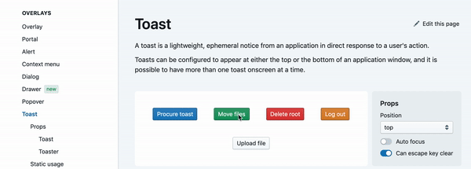

# std-toast
This document scopes out a web platform API for a 'toast' pop-up notification.

## What is a "toast" pop-up notification?

> "Toasts are pretty common in UX design; refers to popup notifications which typically appear at the bottom of the screen (like a piece of toast in a toaster)."

— [Kyle Decker](https://twitter.com/kybradeck/status/1139006173762531328)

Sneha Munot provides a nice definition in her [uxplanet.org article](https://uxplanet.org/toast-notification-or-dialog-box-ae32ad53106d),
where she compares toasts to dialog boxes.

> [A toast] is a small message that shows up in a box at the bottom of the screen and disappears on its own after few seconds.
> It is a simple feedback about an operation in which current activity remains visible and interactive.
> It basically is to inform the user of something that is not critical and that does not require specific attention and does not prevent the user from using the app device.
>
> For example; on gmail when a mail is send you receive a feedback of “Sending message…” written in the form of toast message.

Another concise definition is found in Ben Brocka's [ux.stackexchange.com response](https://ux.stackexchange.com/a/12000):

> A Toast is a non modal, unobtrusive window element used to display brief, auto-expiring windows of information to a user.

This adds which adds the distinguishing detail of a toast being **auto-expiring**.

In the absence of browser-intrinsic toasts,
the current state of affairs is that many libraries and design systems include toast features.
This repository contains a [study group](https://github.com/jackbsteinberg/std-toast/tree/master/study-group) which surveys and compares toast implementations across the web and other platforms.

Below is an animated image displaying some typical toast behaviors,
drawn from the [Blueprint](https://blueprintjs.com/docs/#core/components/toast) design component library.
The study group contains [a variety of such examples](study-group/Library-Demos.md).




## Why?

Modern web applications allow users to complete many actions per page,
which necessitates providing clear feedback for each action.
Toast notifications are commonly used to unobtrusively provide this feedback.

Many libraries in a variety of frameworks implement a version of toast
(see [research](./study-group/)),
but the web has no built-in API to address the use case.
By providing a toast API as part of the web platform's standard library,
the web becomes more competitive with other app development platforms,
and web application developers can spend less of their time and bytes
on implementing this pattern.

Toasts are also a deceptively-tricky pattern to get right.
They require special accessibility considerations,
and scenarios involving multiple toasts need special handling.
[Not all libraries account for these subtleties](./study-group/).
By providing a built-in toast control that fully handles these aspects,
we can level up the typical toast experience for both developers and users of the web.

Finally,
the ecosystem can benefit from a shared understanding of how to create and style toasts.
If the platform provides a toast,
then all libraries and components can freely use toasts to communicate to their users.
Whereas,
if toasts can only be found in libraries,
then importing a toast-using component also means importing their opinion on what the best toast library is.
In the worst case,
this can lead to multiple uncoordinated toast libraries acting on a single page,
each of which needs its own styling and tweaks to fit in to the application.
If instead libraries and components all use the standard toast,
the application developer can centrally style and coordinate them.


## Sample code

The standard toast can be used according to two different patterns.

The first defines a `<std-toast>` HTML element,
then shows it with configurations via a method on the element.
This can be used to declaratively predefine toasts the application will need,
and then show them inside the application logic.

```html
<script type="module">
import 'std:elements/toast';
</script>

<std-toast id="sample-toast" theme="info">
    Hello World!
</std-toast>
```

```js
document.querySelector('#sample-toast').show({
    duration: 3000
});
```

The second imports the `showToast()` function from the `"std:elements/toast"` module,
which takes in a message and some configurations and creates and shows a toast in the DOM.
This is more convenient for one-off toasts,
or for JavaScript-driven situations,
similar to how the `alert()` function can be used show alerts.

```js
import { showToast } from 'std:elements/toast';

const toast = showToast("Hello World!", {
    theme: "info",
    duration: 3000
});
```

## Goals

Across popular toast implementations there are recurring patterns,
which the standard toast aims to accomplish natively.

- The component will be accessible by default;
  native accessibility is a strong priority for toasts,
  as they can be difficult to make properly accessible.

- Toast implementations are often shaped similarly,
  and a goal of the standard toast is to make it as easy as possible for developers
  to build and style toasts that conform to those common shapes.

- The positioning of the toast must be intuitive,
  so the standard toast will come with built-in support for common positions,
  as well as a sensible default.

- To balance ease of use with customization,
  the standard toast will support creating and showing with one JavaScript function,
  as well as writing a custom view with a `<std-toast>` element
  and showing that with a method.

- The standard toast will come with support for showing multiple toasts,
  either by stacking them in the view,
  or queueing them and displaying sequentially.

A broad goal of the standard toast API is to provide a base for more opinionated or featureful toast libraries to layer on top of.
It will be designed and built highly extensible, 
so library implementations can focus on providing more specific styling, better framework support, or more opinionated defaults.
The intent is that any developer looking to use a toast in their work will use a standard toast,
or a library which provides a wrapper on top of standard toast.

TODO([#14](https://github.com/jackbsteinberg/std-toast/issues/14)): create an example of this layering and link to it here.

## Proposed API

The element is provided as a [built-in module](https://github.com/tc39/proposal-javascript-standard-library/blob/master/README.md),
named `"std:elements/toast"`.
See [whatwg/html#4697](https://github.com/whatwg/html/issues/4697) for more discussion on "pay-for-what-you-use" elements available via module imports.

### The `<std-toast>` element

#### Attributes

- [Global attributes](https://html.spec.whatwg.org/multipage/dom.html#global-attributes)
- `open`: a boolean attribute, determining whether the toast is visible or not (according to the default styles).
By default toasts are not shown.
- `theme`: one of `"default"`, ???, or ???, conveying the semantic priority of the toast, and influencing its styling (both default and user-provided)
    - TODO([#18](https://github.com/jackbsteinberg/std-toast/issues/18)): decide on list of themes to natively support and create and style them.
- `position`: default position will be ???
    - Options for position:
        - `"top-left"`
        - `"top-center"`
        - `"top-right"`
        - `"center"`
        - `"bottom-left"`
        - `"bottom-center"`
        - `"bottom-right"`
    - TODO([#39](https://github.com/jackbsteinberg/std-toast/issues/39)): Do we need values `"top-stretch"`, `"center-stretch"`, and `"bottom-stretch"` as well? Should this stretching be done automatically on mobile?
The default (if the attribute is omitted or set to an invalid value) is ???.
    - TODO([#13](https://github.com/jackbsteinberg/std-toast/issues/13)): should this positioning be an attribute or a style
- `closebutton`: a boolean attribute, determining whether an explicit close button is shown. 
By default toasts do not have a close button.
    - TODO: where should the `closebutton` show up relative to toast content,
    and how customizable should it be?

All attributes will be reflected as properties on the element's JavaScript interface.
For example:

```js
const toast = document.createElement('std-toast');
console.log(toast.open); // false
```

#### Contents

The `<std-toast>` element can be used as a generic container,
but will work best (in terms of default styling and events) if the developer conforms to the following content model:

- The first child node,
  typically either a text node or a container like `<p>`,
  provides a message.
- If more than one child node is present,
  then the last child element,
  which can be either an `<a>` or a `<button>`,
  provides a call to action.

TODO([#17](https://github.com/jackbsteinberg/std-toast/issues/17)): what about title or icon? They should potentially also be accomodated, in a similar fashion.

Thus, the following would all work well out of the box:

```html
<std-toast>Hello world!</std-toast>

<std-toast><p>Hello world!</p></std-toast>

<std-toast>
  <p>Hello world!</p>
  <button>Click me!</button>
</std-toast>

<std-toast>
  <p>Hello world!</p>
  <a href="https://example.com/" target="_blank">Click me!</button>
</std-toast>
```

TODO([#21](https://github.com/jackbsteinberg/std-toast/issues/21)): How will this pattern support work well?

These can equivalently be created via JavaScript: ([#12](https://github.com/jackbsteinberg/std-toast/issues/12))

```js
// TODO: write this once we figure out the JS API for supplying HTML messages,
// and for supplying customizable actions
```

More complex toasts,
that don't fit the above content model,
would require more custom handling on the part of the developer:

```html
<std-toast>
  <p>Hello world!</p>
  <p>A second paragraph?!</p>

  <button>Action 1</button>
  <button>Action 2</button>
</std-toast>
```

Such an unusual toast would still integrate with other toasts in terms of stacking and positioning behavior,
and some of the default styles that are inherited may be useful.
But the page author will need to handle the action clicks themselves (instead of using the `"actionclick"` event),
and will need to add additional styling to handle the extra contents.

TODO: when we have a prototype, link to/show an example of this in action.

#### Methods

- `.show(options)`: shows the toast element,
by toggling its `open=""` attribute to true.
It will also start or reset the timeout of the toast,
to show for the provided `duration`,
or a default `duration` of `2000`ms.
The `options` include:
    - `duration`: how long to show the toast, in milliseconds. Defaults to `2000`.
    - `multiple`: ???
    - `newestOnTop`: ???

TODO([#19](https://github.com/jackbsteinberg/std-toast/issues/19)): how do `multiple` and `newestOnTop` work?

- `.hide()`: hides the toast element,
by toggling its `open=""` attribute to false.
- `.toggle([state])`: toggles the toast element,
by hiding it if it's being shown and showing it if it's being hidden,
or alternately adding/removing the `open=""` attribute per `state` if `state` given.

#### Events

A `<std-toast>` element can fire the following events:

- `"show"`: the toast was shown
- `"hide"`: the toast was hidden, either explicitly by the user, or via the timeout.
  (Note: if animations were applied, the toast may not be entirely invisible at the time this event fires)
    - TODO: should we consider separate events for the start and end of any hide animation?
      This seems hard to do correctly if the user customizes the animation, though.
- `"actionclick"`: the toast's call-to-action button or link was clicked, if one exists.
    - TODO([#11](https://github.com/jackbsteinberg/std-toast/issues/11)): flesh out exactly how the action works and how this event is linked.

TODO([#35](https://github.com/jackbsteinberg/std-toast/issues/35)): split `"show"` and `"hide"` into `"will/didShow"` and `"will/didHide"`.

### `showToast(message, options)`

The `"std:elements/toast"` module also exports a convenience function,
`showToast()`,
which allows creating and showing toasts entirely from JavaScript.
Behind the scenes,
`showToast()` creates a `<std-toast>`,
sets it up using the given message and options,
inserts it as the last child of `<body>`,
and then adds the `open=""` attribute,
to make the toast visible.
Finally,
it returns the created `<std-toast>` element,
allowing further manipulation by script.

`message` is a string that will be inserted as a text node into the created `<std-toast>`.

`options` allows configuring both the attributes of the `<std-toast>`,
and the options for this particular showing of the toast.
Thus, the possible options are:

- `theme`, like the attribute
- `position`, like the attribute
- `closeButton`, like the attribute
- `duration`, like the `show()` option
- `multiple`, like the `show()` option
- `newestOnTop`, like the `show()` option

TODO([#11](https://github.com/jackbsteinberg/std-toast/issues/11)): How should actions be handled?

TODO([#15](https://github.com/jackbsteinberg/std-toast/issues/15)): Should a toast generated by `showToast()`
get removed from the DOM, and if so should there be cases where it remains?

### Default styles

The standard toast will come with these default styles,
which developers will be able to change to customize look and feel.

#### `std-toast:not([open])`

- `display: none`: this will keep the toast hidden from view and searching
when the `open` attribute is not present.

#### `std-toast([open])`

TODO: figure out some default styles, and state them here.
Additionally figure out default styles for themes.

### Appearance customization

TODO([#20](https://github.com/jackbsteinberg/std-toast/issues/20)): explain any API for appearance customization,
beyond just normal CSS.
For example,
a CSS shadow part for the close button,
or some CSS variables.

## Accessibility

## Common Patterns

### Show existing toast
```html
<std-toast id="sample-toast">
    Hello World!
</std-toast>
```

```js
document.querySelector('#sample-toast').show();
```

### Create and show new toast with options
```js
const toast = showToast("Hello World!", {
    theme: "info",
    duration: 3000
});
```

### Show toast in container
```html
<div id="container"></div>
```

```js
const toast = showToast("Hello World!");
document.querySelector("#container").append(toast);
```

### Reusable config object

```js
const configs = {
    theme: 'info',
    duration: 3000
}

const toast1 = showToast("number 1", configs);
const toast2 = showToast("number 2", configs);
```

### Styling the toast
TODO

## Security and Privacy Considerations
See [TAG Security / Privacy Self Review](/security-privacy-self-review.md).

## Considered Alternatives

### Extending the Notification API
Toasts are intended to be ephemeral, context-specific messages,
and collecting them in a user's notifications tray doesn't reflect the spirit of the pattern.
[kenchris](https://github.com/kenchris) put this well in [this comment](https://github.com/w3ctag/design-reviews/issues/385#issuecomment-502070938) on the TAG Design Review:

> the difference is that this is a temporary notification / infobar, 
> like you see for PWAs ("new version available, press reload to refresh") 
> or like in GMail ("Chat is currently unavailable") etc. 
> These are not things you want an actual system notification for... 
> They really depend on the surrounding content/situation unlike regular notifications.

Toasts also often contain some sort of action the user can take which affects the state of the page 
(e.g. un-sending an email on Gmail).
To provide this kind of behavior accessibly the element should live wholly in the page / DOM.
This will have the added benefit of preventing pages in the background from using toasts to fight for user attention.

### Extending the `<dialog>` element
This approach was considered, but we decided to go a different route for a few reasons.
First and foremost, we felt the accessibility considerations for a toast and a dialog are fundamentally opposed,
as the dialog engages in the kind of flow-breaking behavior we want toasts to avoid.
Additionally, the popular pattern of adding a call to action button on a toast with a baked-in time limit
necessitates replacing tab-trapping with a less intrusive, easily restored alternative.

### As a new global element (instead of a built-in module)
See [here](https://github.com/whatwg/html/issues/4697).

### Leaving this up to libraries
See [here](https://github.com/tkent-google/std-switch#leaving-this-up-to-libraries).

## Extra Resources
This proposal comes in parallel with the [proposal for a standard switch element](https://github.com/tkent-google/std-switch),
which has a good [FAQs section](https://github.com/tkent-google/std-switch#faqs), many of which apply to this proposal as well.
Additionally, the idea of creating new polyfillable HTML elements is being explored in 
[this issue](https://github.com/whatwg/html/issues/4696) on the HTML standard, 
and the idea of creating new pay-for-what-you-use HTML elements if being explored in 
[this issue](https://github.com/whatwg/html/issues/467) on the HTML standard.
There is also currently an [open discussion](https://discourse.wicg.io/t/proposal-toast-ui-element/3634)
on the WICG discourse page to gauge and solicit community interest in moving the explainer to incubate in a WICG repo.
