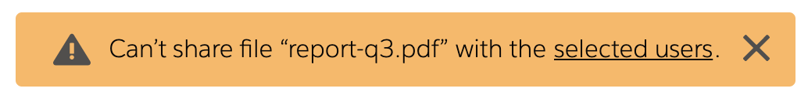

# Toast Visual Designs

This document assembles examples of toast visual design from currently available libraries.

## Libraries

- [react-toastify](#react-toastify)
- [Blueprint](#Blueprint)
- [ngx-toastr](#ngx-toastr)
- [Bootstrap](#Bootstrap)
- [Sweet Alert2](#Sweet-Alert2)
- [Material UI Snackbar](#Material-UI-Snackbar)
- [Ionic](#Ionic)
- [Salesforce Lightning Design](#Salesforce-Lightning-Design)
- [Notyf](#Notyf)
- [Polymer paper-toast](#Polymer-paper-toast)
- [Android Snackbar](#Android-Snackbar)
- [Android Toast](#Android-Toast)

### [react-toastify](https://www.npmjs.com/package/react-toastify)

### [Blueprint](https://blueprintjs.com/docs/#core/components/toast)

### [ngx-toastr](https://www.npmjs.com/package/ngx-toastr)

### [Bootstrap](https://getbootstrap.com/docs/4.3/components/toasts/)

### [Sweet Alert2](https://sweetalert2.github.io/)

### [Material UI Snackbar](https://material-ui.com/api/snackbar/)

### [Ionic](https://ionicframework.com/docs/api/toast)

### [Salesforce Lightning Design](https://lightningdesignsystem.com/components/toast/)

### [Notyf](https://github.com/caroso1222/notyf)

### [Polymer paper-toast](https://www.webcomponents.org/element/@polymer/paper-toast)

### [Android Snackbar](https://developer.android.com/reference/com/google/android/material/snackbar/Snackbar)

### [Android Toast](https://developer.android.com/reference/android/widget/Toast)

